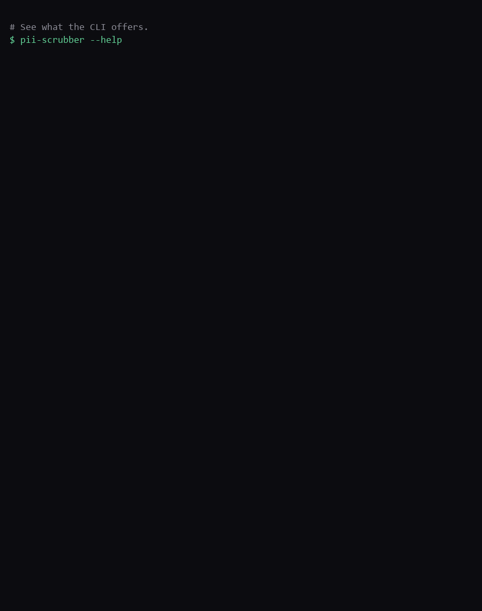

# pii-scrubber: step-by-step walkthrough

This walkthrough is generated directly from a real, passing run of the CLI (see `tools/record_demo.py`) - every command and output below is the actual output produced by that run, not hand-written.



`upload` and `list` aren't shown below since their output includes your local `~/.pii-scrubber` path - see the [Usage](../README.md#usage) section of the README for those.

## 1. See what the CLI offers.

```console
$ pii-scrubber --help
Usage: pii-scrubber [OPTIONS] [COMMAND] [ARGS]...

  Scrub PII from documents, locally, before you paste/upload them elsewhere.

  Run with no command for an interactive menu.

Options:
  --version  Show the version and exit.
  --help     Show this message and exit.

Commands:
  doctor  Check whether spaCy NER can actually load in this environment.
  list    List files stored locally by pii-scrubber (uploads and outputs).
  menu    Interactive "PII - Scrubber" menu - pick an action instead of...
  redact  Write a redacted copy of PATH in its original file format.
  scrub   Print PII-redacted text extracted from PATH, plus a summary count.
  upload  Copy PATH into pii-scrubber's local, offline file storage...
```

## 2. Scrub a plain text file and preview the redacted text + a summary count, without writing any file.

```console
$ pii-scrubber scrub patient_intake.txt
Patient Intake Form

Name: [PERSON]: [EMAIL]
Phone: [PHONE]
SSN: [SSN]
Employer: [ORGANIZATION], located in [LOCATION].


Found:
  EMAIL: 1
  LOCATION: 1
  ORGANIZATION: 1
  PERSON: 1
  PHONE: 1
  SSN: 1
```

## 3. Scrub a Markdown file and preview the redacted text + a summary count, without writing any file.

```console
$ pii-scrubber scrub notes.md
# Follow-up notes

Reach **Jane Doe** at [EMAIL] or [PHONE] before the Friday deadline.


Found:
  EMAIL: 1
  PHONE: 1
```

## 4. Scrub a HTML file and preview the redacted text + a summary count, without writing any file.

```console
$ pii-scrubber scrub profile.html

Contact card
[PERSON]
LinkedIn: [SOCIAL_PROFILE]


Found:
  PERSON: 1
  SOCIAL_PROFILE: 1
```

## 5. Scrub a CSV file and preview the redacted text + a summary count, without writing any file.

```console
$ pii-scrubber scrub contacts.csv
name, email, phone
[PERSON], [EMAIL], [PHONE]
[PERSON], [EMAIL], [PHONE]

Found:
  EMAIL: 2
  PERSON: 2
  PHONE: 2
```

## 6. Scrub a JSON file and preview the redacted text + a summary count, without writing any file.

```console
$ pii-scrubber scrub record.json
[PERSON]
[EMAIL]
[PHONE]

Found:
  EMAIL: 1
  PERSON: 1
  PHONE: 1
```

## 7. Scrub a Word (.docx) file and preview the redacted text + a summary count, without writing any file.

```console
$ pii-scrubber scrub letter.docx
Employment Letter
This confirms [PERSON] ([EMAIL], [PHONE]) is employed at [ORGANIZATION]

Found:
  EMAIL: 1
  ORGANIZATION: 1
  PERSON: 1
  PHONE: 1
```

## 8. Scrub a PDF file and preview the redacted text + a summary count, without writing any file.

```console
$ pii-scrubber scrub notice.pdf
Please contact [PERSON] at [EMAIL] or [PHONE].


Found:
  EMAIL: 1
  PERSON: 1
  PHONE: 1
```

## 9. Write a redacted copy of the file, format preserved.

```console
$ pii-scrubber redact patient_intake.txt
Wrote patient_intake_redacted.txt
```

## 10. Confirm the original PII is gone from the redacted file.

```console
$ cat patient_intake_redacted.txt
Patient Intake Form

Name: [PERSON]: [EMAIL]
Phone: [PHONE]
SSN: [SSN]
Employer: [ORGANIZATION], located in [LOCATION].
```

## 11. Check whether this environment can actually run spaCy NER (catches a Windows Application Control block before it surfaces mid-scrub).

```console
$ pii-scrubber doctor
Checking spaCy NER availability...
OK: spaCy NER model loaded fine.
```

## 12. The interactive menu (also launched by running `pii-scrubber` with no command) - pick an action instead of remembering flags. Exiting immediately here (choice 0) since the other options touch your local ~/.pii-scrubber folder.

```console
$ pii-scrubber menu
================================
      PII - Scrubber
================================

1) Upload a file
2) Scrub a file (print redacted text)
3) Redact a file (save a cleaned copy)
4) List stored files
5) Doctor (check NER availability)
0) Exit
Choose an option (0, 1, 2, 3, 4, 5): 
```
